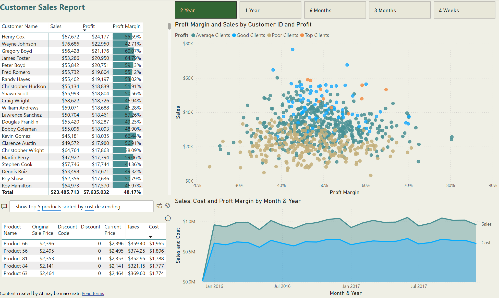

# Overview
- Created a Power BI report that segmentes the customers into group by profitability. The profitability metric, is a stand alone table not connected to the model, and is easily adjustable.

  ## DAX
  - Details about some of the DAX used in the report.
  - The customer profitability was  manually entered by me. No DAX was needed and as you can see it's pretty simple
  
    

  - Comparing the customer profitability against the relative table in DAX is where it can get a little trickey. Since I want to segment my customers I need to reference the newly created tables against my 'Customers' table (which you can see in the first column of the table above) and compare the profitability of the client against the values I defined.
    -profitability could easily be any other metric
  ```DAX
  Profit Groups = 
  CALCULATE(
      SELECTEDVALUE('Client Profitability'[Profit Group]),
      FILTER(
          'Client Profitability',
          [Total Profit] >= 'Client Profitability'[Min] &&
          [Total Profit] < 'Client Profitability'[Max]
      )
  )
  ```
# Final Report
- Here's the report in all it's glory.


