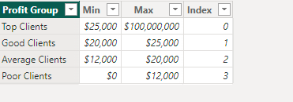
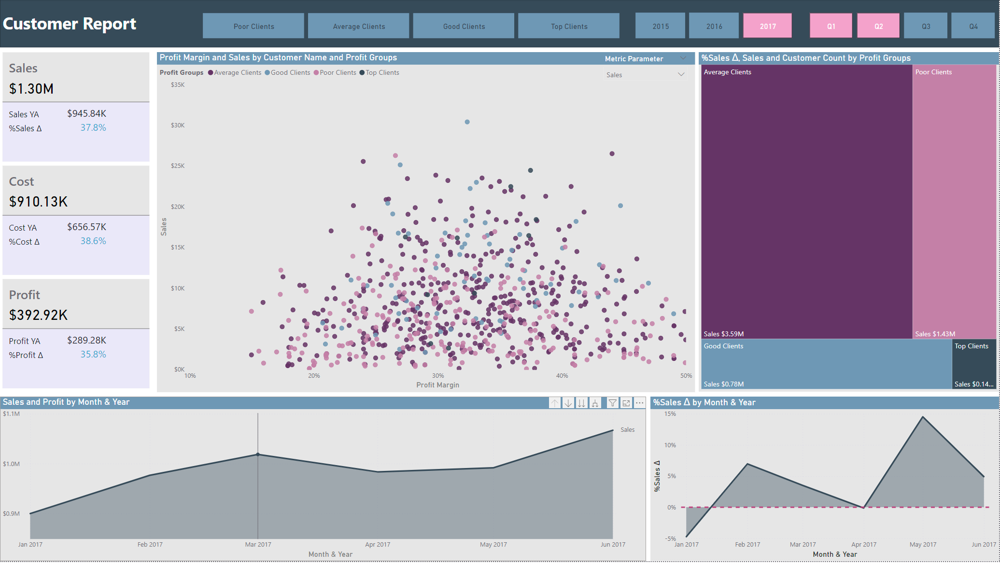
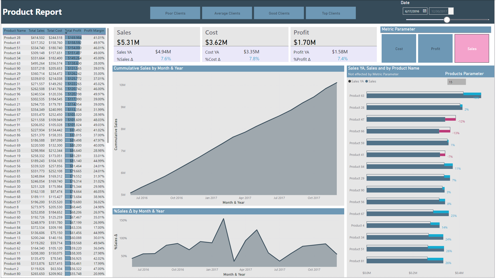

# Overview

- Developed a Power BI report that features customer segmentaion, DAX code that dynamically filters based on user input, as well as a custom IBCS inspired bar chart using native Power BI visuals.
- I plan on addinga Xgboosted Python visual soon that will predict customer or product profit over time.

## DAX

- Details about some of the DAX used in the report.
- The customer profitability was  manually entered by me. No DAX was needed and as you can see it's pretty simple
  
    

  - Comparing the customer profitability against the relative table in DAX is where it can get a little trickey. Since I want to segment my customers I need to reference the newly created tables against my 'Customers' table (which you can see in the first column of the table above) and compare the profitability of the client against the values I defined.
    -profitability could easily be any other metric

  ```DAX

  Profit Groups = 
  CALCULATE(
      SELECTEDVALUE('Client Profitability'[Profit Group]),
      FILTER(
          'Client Profitability',
          [Total Profit] >= 'Client Profitability'[Min] &&
          [Total Profit] < 'Client Profitability'[Max]
      )
  )
  ```
  
  - The following DAX code is essentialy the same thing, but I'm using the code to filter my date table. This way I can have pre defined date periods as filters and can use buttons instead of a date slider.

### Report screenshots

- Customer report page


- Product report page

